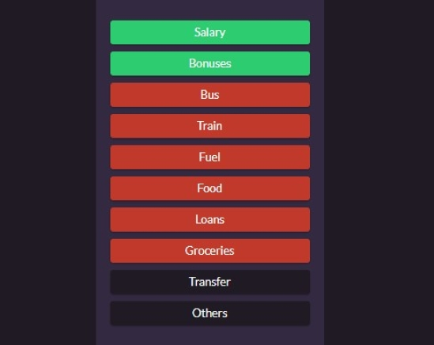

# Expense Tracker

## Contents
* [General info](#general-info)
* [Screenshots](#screenshots)
* [Technologies](#technologies)
* [Setup](#setup)
* [Features](#features)
* [Status](#status)
* [Credits](#credits)
* [Contact](#contact)

## General info
Fullstack Expense Tracker App
> Track spending habits and be in control of your spending to achieve your financial goals! :smile:

## Screenshots
#### Balance Dash

> Total income and expense at a glance

#### Past Transactions

> Monitor and delete your transactions

#### Categories

> Various array of choices

## Technologies
### MERN Stack
- MongoDB
- Express
- ReactJS
- NodeJS
- Deployed using Heroku
- REST Api ==> [API](https://sheltered-refuge-87677.herokuapp.com/api/v1/transactions)

## Setup
Clone main branch of git repository to desired directory with `git clone`

>`git clone https://github.com/thchong-code/ExpenseTracker.git`

Run `npm install` in console inside the root of ExpenseTracker to install all dependencies.

Create a file named `config.env` inside the config folder & add in the following:

* `MONGODB_URI= (create a database in mongoDB Atlas paste the link to connect here, remember to include inverted commas)
   NODE_ENV=production
   PORT=5000`

To start the app locally, run `npm run dev` in console which starts up both frontend and backend concurrently.

## Features
#### Functional :smile:
* Add an item and its expense/ income
* Delete item object
* Displays account balance + income & expense values

#### W.I.P
* User credientials
* JWT authentication (backend done --> see loginFunction branch)
* Interactive dashboard --> Charts and graphs you name it!

## Status --> Running

## Credits
Adapted from Vanilla projects and converted to ReactJS:

[VanillaProjects](https://github.com/bradtraversy/vanillawebprojects/tree/master/expense-tracker)

## Contact
[@HCTANG](https://github.com/thchong-code) - feel free to contact me!